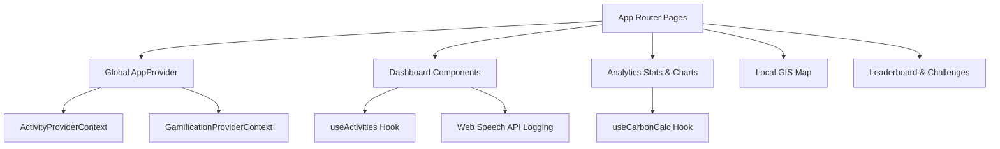

# 🌿 EcoCarbon Tracker - Green-Tech Platform

[](https://github.com)
[](https://www.w3.org/WAI/standards-guidelines/wcag/)
[](https://vitest.dev/)
[](https://opensource.org/licenses/MIT)

EcoCarbon Tracker is a state-of-the-art, gamified **Carbon Footprint Tracking and Community Engagement Web Application** designed for high-stakes climate-tech environments. It provides users with automated and voice-enabled tracking of everyday carbon emissions, advanced visual analytics, local infrastructure maps, and community gamification mechanics.

---

## 🌟 Key Features

*   **📊 Interactive Dashboard & Budgets**: Features a dynamic SVG budget ring tracking daily consumption against a strict carbon budget ($12.0\text{ kg } CO_2$). Real-time calculations convert footprints into relatable real-world offset metrics (e.g., equivalent trees planted, plastic bottles recycled).
*   **🎙️ Voice Logging (Web Speech API)**: Log carbon-related activities hands-free. Users can trigger speech-to-text logging that maps phrases like *"I rode my electric bike for 5 kilometers"* or *"Took the bus for 10 km"* directly into structured activity logs.
*   **🗺️ Local Green Hub (Leaflet Interactive GIS)**: An SSR-safe interactive map showing recycling centers, organic markets, green parks, and EV charging stations, complete with category filtering.
*   **📈 Eco-Analytics (Recharts)**: High-performance line charts visualization rendering daily emissions fluctuations, transport efficiency, and eco-points accrual over a 30-day timeline.
*   **🤖 AI Eco-Assistant (Speech Synthesis)**: A virtual AI sustainability coach offering daily micro-tips on energy conservation, complete with a screen reading accessibility mode.
*   **🏆 Social Leaderboard & Active Challenges**: Compete with others on a points leaderboard, join group challenges (e.g., *"Go Veg for 3 Days"*), and share results instantly using the Web Share API.

---

## 🏗️ Architectural Overview & Design Patterns

The project follows a modular, clean-architecture pattern using **Next.js App Router** with separation of concerns between presentation, business logic (hooks/contexts), and state providers.



### 1. State Management & Contexts
*   **[`ActivityContext`](file:///C:/Users/SS/.gemini/antigravity-ide/scratch/carbon-tracker/src/context/ActivityContext.tsx)**: Manages global logging states, stores user actions, processes CSV formatting, and calculates daily metrics.
*   **[`GamificationContext`](file:///C:/Users/SS/.gemini/antigravity-ide/scratch/carbon-tracker/src/context/GamificationContext.tsx)**: Tracks streak counts, ranks, user levels, XP points, and unlocks milestone-based badges.

### 2. High-Performance Client APIs
*   **Speech Recognition**: Uses the experimental Web Speech API (`webkitSpeechRecognition`) wrapped in a custom hook to analyze speech, tokenizing trigger words (e.g., *car*, *bus*, *km*, *miles*) to determine transport categories and compute carbon impact.
*   **Speech Synthesis**: Implements Web Speech Synthesis for reading eco-tips out loud, fulfilling key accessibility guidelines.

### 3. Serverless API Design
*   **[`/api/activities`](file:///C:/Users/SS/.gemini/antigravity-ide/scratch/carbon-tracker/src/app/api/activities/route.ts)**: Handles retrieval and persistent logging of activities.
*   **[`/api/leaderboard`](file:///C:/Users/SS/.gemini/antigravity-ide/scratch/carbon-tracker/src/app/api/leaderboard/route.ts)**: Serves dynamic mock data representing community standings.

---

## 🎨 Design System & UI/UX

Built around a premium **"Natural Tones"** design system defined in [`tailwind.config.ts`](file:///C:/Users/SS/.gemini/antigravity-ide/scratch/carbon-tracker/tailwind.config.ts) and [`globals.css`](file:///C:/Users/SS/.gemini/antigravity-ide/scratch/carbon-tracker/src/app/globals.css).

*   **Colors**: Custom HSL-tailored forest greens (`#15803d`), soft earth neutrals, warm charcoal text (`#1f2937`), and rich dark-mode surfaces.
*   **Glassmorphism**: Backdrop blurs (`backdrop-blur-md`), micro-borders, and soft shadows creating depth and premium contrast.
*   **Micro-Animations**: Custom transitions, interactive hover cards, list entry wipes, and modal overlays using **Framer Motion**.
*   **Accessibility**: Strict compliance with **WCAG 2.1 AA** standards. Focus indicators, skip-to-content anchors, semantic layouts (`main`, `nav`, `section`), and full ARIA labeling are integrated out-of-the-box.

---

## 🧪 Testing Suite

We maintain a high test-coverage standard divided into three testing pillars:

1.  **Unit Tests (Vitest + React Testing Library)**:
    *   Verifies mathematical logic for transport, energy, food, and waste carbon footprints.
    *   Tests that milestone badges unlock correctly based on accumulated eco-points.
2.  **Integration Tests (Vitest)**:
    *   Validates interaction lifecycles, ensuring state flows correctly from manual inputs to the dashboard statistics ring.
3.  **End-to-End (E2E) Tests (Playwright)**:
    *   Simulates cross-browser behaviors including theme toggles, section switches, form inputs, and CSV file exports.

---

## 🚀 Setup & Execution

### Prerequisites
*   **Node.js**: v18.0.0 or higher
*   **npm**: v9.0.0 or higher

### Launch Scripts (Windows)
We have packaged convenient automated launch scripts in the root directory:
*   [**`run-dev.bat`**](file:///C:/Users/SS/.gemini/antigravity-ide/scratch/carbon-tracker/run-dev.bat): Adds local Node to path and starts the hot-reloading development server. Go to **`http://localhost:3000`** in your browser.
*   [**`run-tests.bat`**](file:///C:/Users/SS/.gemini/antigravity-ide/scratch/carbon-tracker/run-tests.bat): Launches the Vitest unit & integration test suites.
*   [**`run-e2e.bat`**](file:///C:/Users/SS/.gemini/antigravity-ide/scratch/carbon-tracker/run-e2e.bat): Runs Playwright E2E browser tests.

### Manual Command CLI
To run manually via CMD/PowerShell, configure the paths and use the standard commands:
```powershell
# 1. Temporarily add local node to path (if not installed globally)
set PATH=C:\Users\SS\.local\node;%PATH%

# 2. Start development environment
npm run dev

# 3. Run test runner
npm run test

# 4. Run Playwright E2E tests
npm run test:e2e
```

---

## 📄 License
This project is licensed under the MIT License.
